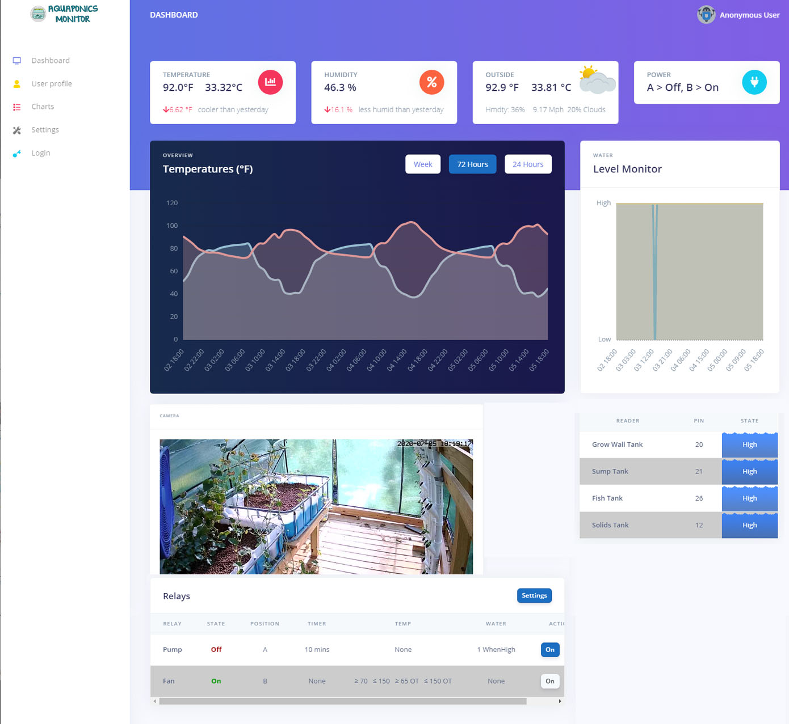
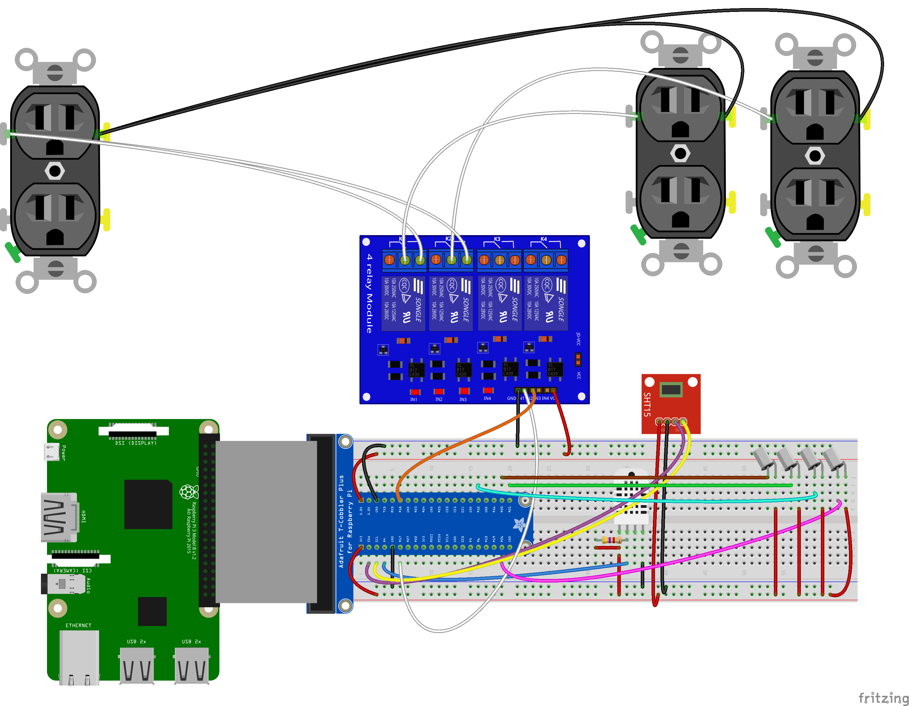
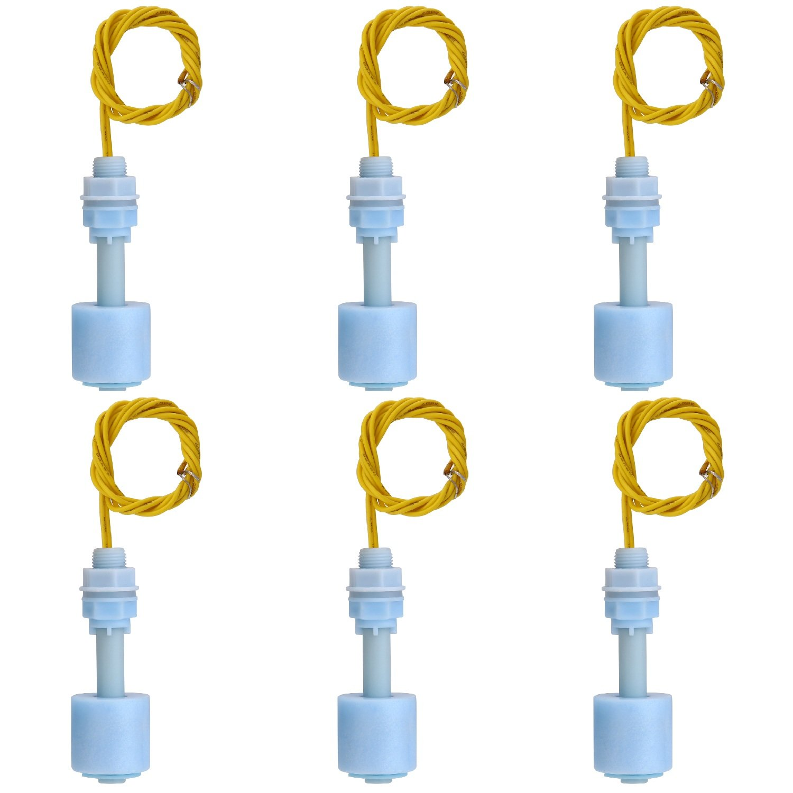
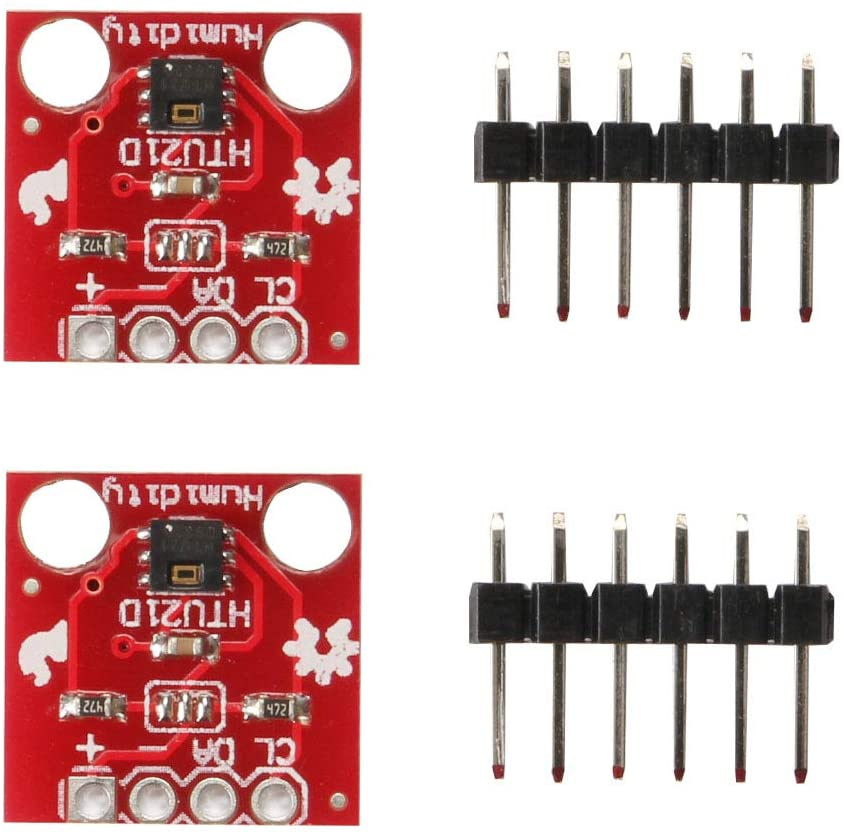
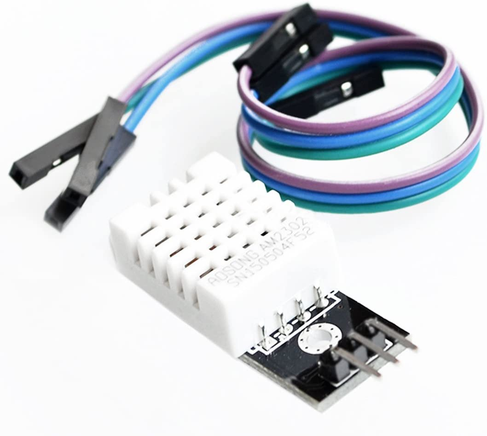
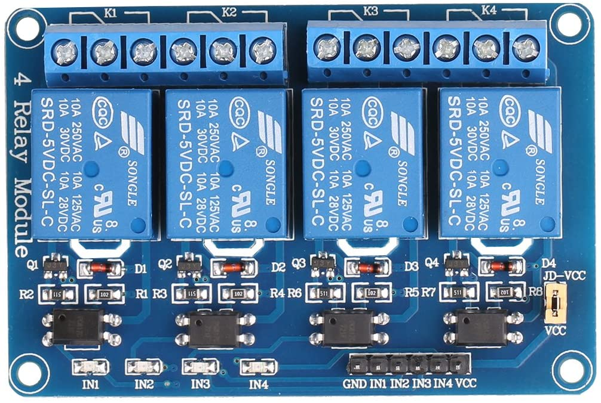
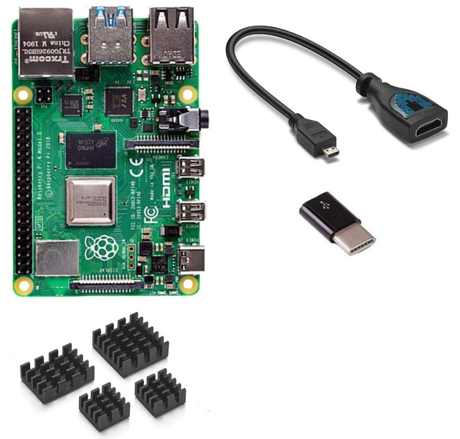
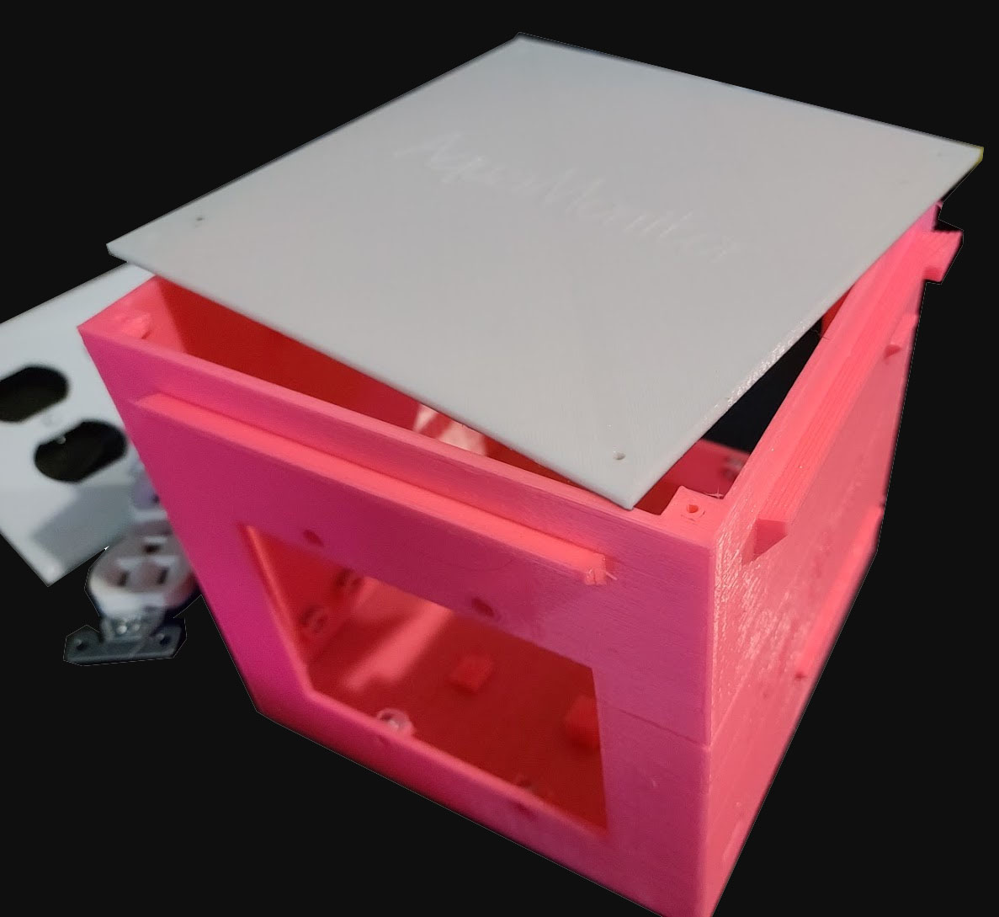

## Aquaponics System
### Raspberry Pi Setup (3 B+) / 4

#### Web Downloader
Updated the deploy system to automatically get updates when code changes are checked in and merged to the master branch.  This can be disabled by editing your appsettings.json file for your /usr/local/aquadeploy

##### Quick install on a 32bit OS Ubuntu
sudo wget https://raw.githubusercontent.com/hargrave81/Aquamonitor/master/installubuntu.sh -v -O install.sh && sudo chmod +777 install.sh && sudo ./install.sh; sudo rm -rf install.sh

##### USB Wifi Dongle (Realtek Installer)
sudo wget https://raw.githubusercontent.com/hargrave81/Aquamonitor/master/install-wifi.sh -v -O /usr/bin/install-wifi && sudo chmod +777 /usr/bin/install-wifi && sudo /usr/bin/install-wifi

#### Disable onboard Wifi
- if your onboard wifi isn't cutting the cheese here is how to disable it
- sudo nano /boot/config.txt        add the following line
  dtoverlay=pi3-disable-wifi
- sudo nano /etc/modprobe.d/raspi-blacklist.conf
  #wifi
  blacklist brcmfmac
  blacklist brcmutil
- save changes and reboot
  

##### Initial Setup - Full Raspberry Pi Support
- Download Latest Raspberry Pi OS (32bit w/Desktop)
  https://www.raspberrypi.org/downloads/raspberry-pi-os/
- Use balenaEtcher https://www.balena.io/etcher/ to burn the image to a microSD
- Boot your Raspberry Pi up with your freshly minted microSD card
- Complete the auto setup and updates, connect to your wifi
- setup console mode
  run terminal, type sudo raspi-config
  choose boot options
  choose desktop / cli
  select Console Auto Login
  now finish and save
  exit the console (go ahead and reboot to console mode)
- RECOMMENDED - USE THE QUICK INSTALL FROM HERE ON OUT
- type the following into the console to launch quick install
    sudo wget https://raw.githubusercontent.com/hargrave81/Aquamonitor/master/installpi.sh -v -O install.sh && sudo chmod +777 install.sh && sudo ./install.sh; sudo rm -rf install.sh
- update the password for the remote FTP user from default, type the following into the console
    passwd remote

##### Install VSFTP
- sudo apt install vsftpd
- sudo systemctl start vsftpd
- sudo systemctl enable vsftpd
- sudo useradd –m remote
- sudo passwd remote
- sudo ufw allow 20/tcp
- sudo ufw allow 21/tcp
- sudo nano /etc/vsftpd.conf
  - Find the entry labeled write_enable=NO, and change the value to “YES.”
- sudo systemctl restart vsftpd.service 

##### Install ASPNET CORE 3.1 x64
- cd /home/ubuntu
- wget https://download.visualstudio.microsoft.com/download/pr/2ea7ea69-6110-4c39-a07c-bd4df663e49b/5d60f17a167a5696e63904f7a586d072/dotnet-sdk-3.1.102-linux-arm64.tar.gz
- wget https://download.visualstudio.microsoft.com/download/pr/ec985ae1-e15c-4858-b586-de5f78956573/f585f8ffc303bbca6a711ecd61417a40/aspnetcore-runtime-3.1.2-linux-arm64.tar.gz
- mkdir /home/ubuntu/dotnet-arm64
- tar zxf dotnet-sdk-3.1.102-linux-arm64.tar.gz -C /home/ubuntu/dotnet-arm64
- tar zxf aspnetcore-runtime-3.1.2-linux-arm64.tar.gz -C /home/ubuntu/dotnet-arm64
- sudo nano .profile
  - add the following lines to the end of the document and save it using CTRL+O [enter], CTRL+X
    # set .NET Core SDK and Runtime path
    export DOTNET_ROOT=$HOME/dotnet-arm64
    export PATH=$PATH:$HOME/dotnet-arm64

##### Install NGINX
- sudo apt-get install nginx
- sudo /etc/init.d/nginx start
- sudo nano /etc/nginx/sites-available/default
  - copy contents of default.conf, then restart nginx with following commands
- sudo nginx -t
- sudo nginx -s reload
- sudo ufw allow 80/tcp

##### Install AquaMonitor
- sudo apt install libgdiplus
- sudo apt-get install unzip
- sudo nano /etc/systemd/system/kestrel-aquamonitor.service
  - copy contents of Aquamonitorservice
- install the aquamonitor
  - sudo mkdir /usr/local/wwwroot
  - sudo mkdir /usr/local/wwwroot/Publish
  - wget https://github.com/hargrave81/Aquamonitor/raw/master/AquaMonitor.zip
  - wget https://github.com/hargrave81/Aquamonitor/raw/master/AquaDeploy.zip
  - sudo unzip -o AquaMonitor.zip -d /usr/local/wwwroot/Publish
  - sudo unzip -o AquaDeploy.zip -d /usr/local/aquadeploy
- sudo systemctl enable kestrel-aquamonitor.service
- sudo systemctl start kestrel-aquamonitor.service
- sudo systemctl status kestrel-aquamonitor.service
- sudo nano /etc/systemd/system/kestrel-aquadeploy.service
  - copy contents of Aquadeployservice
- sudo systemctl enable kestrel-aquadeploy.service
- sudo systemctl start kestrel-aquadeploy.service
- sudo systemctl status kestrel-aquadeploy.service

##### HTU21D support - Raspbian OS is going to be the preferred solution moving forward
Requires Raspbian OS
Requires linux-arm (not 64 builds)

##### FFMPEG
- Required download for testing, is pre installed with raspbian OS

##### Building source code - Aquamonitor
- On Build Box 64bit
dotnet publish ./AquaMonitor/AquaMonitor.csproj -c Release -o ./Publish -r linux-arm64
Compress-Archive -Path Publish/* -DestinationPath AquaMonitor.zip -CompressionLevel "Optimal" -Force
- On Build Box 32bit 
dotnet publish ./AquaMonitor/AquaMonitor.csproj -c Release -o ./Publish32 -r linux-arm
Compress-Archive -Path Publish32/* -DestinationPath AquaMonitor32.zip -CompressionLevel "Optimal" -Force
- on Raspberry Pi
sudo systemctl stop kestrel-aquamonitor.service
sudo unzip -o /home/remote/AquaMonitor32.zip -d /usr/local/wwwroot/Publish
or
sudo unzip -o /home/remote/AquaMonitor.zip -d /usr/local/wwwroot/Publish
then
sudo systemctl start kestrel-aquamonitor.service

##### WebDeploy Helper
- On Build Box 64bit
dotnet publish ./WebDeploy/WebDeploy.csproj -c Release -o ./DeployLinux -r linux-arm64
Compress-Archive -Path DeployLinux/* -DestinationPath AquaDeploy.zip -CompressionLevel "Optimal" -Force
- On Build Box 32bit 
dotnet publish ./WebDeploy/WebDeploy.csproj -c Release -o ./DeployLinux32 -r linux-arm
Compress-Archive -Path DeployLinux32/* -DestinationPath AquaDeploy32.zip -CompressionLevel "Optimal" -Force
- On Raspberry Pi
  - transfer zip file to raspberry pi  
  - sudo systemctl stop kestrel-aquadeploy.service
  - sudo unzip -o /home/remote/AquaDeploy32.zip -d /usr/local/aquadeploy
  or
  - sudo unzip -o /home/remote/AquaDeploy.zip -d /usr/local/aquadeploy
  - sudo systemctl start kestrel-aquadeploy.service    

Sample Monitor:

Sample Wiring Diagram:

Parts:
*Water Float Switch

One of the two temp sensors

*HTU21D Temp Sensor

*AM2302 Temp Sensor

*4 Channel Relay Module

*Raspberry Pi 4 2GB - I Suggest a kit that includes power supply, heat sinks, and an HDMI cable

3D Printable Box: Refer to the STL files

